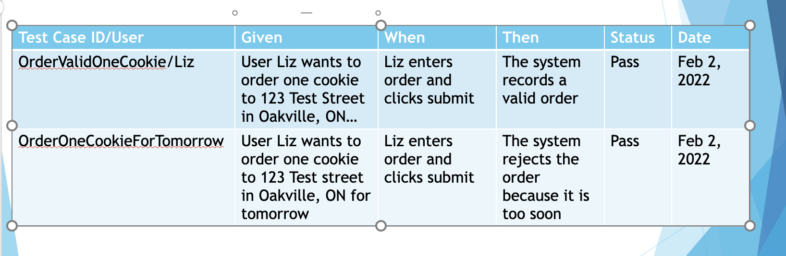

# Testing Plan
## 1. Objectives
- Validate the functionality of the application.

- Ensure the application is free of critical bugs.

- Verify performance, security, and scalability.
## 2. Testing Types
The following types of testing will be performed:

### 2.1 Unit Testing
- Purpose: Test individual components or functions in isolation.

- Scope: Controllers, services, utility functions, and middleware.

- Tools: Jest, Mocha, Chai.

Example:

```javascript
// tests/unit/user-service.test.js
const userService = require('../../services/user-service');

describe('User Service', () => {
  it('should return all users', async () => {
    const users = await userService.getAllUsers();
    expect(users).toBeInstanceOf(Array);
  });
});
```

### 2.2 Integration Testing
- Purpose: Test the interaction between different components (e.g., routes, controllers, and services).

- Scope: API endpoints, database interactions, and middleware.

- Tools: Supertest, Jest.

Example:

```javascript
// tests/integration/user-routes.test.js
const request = require('supertest');
const app = require('../../app');

describe('GET /users', () => {
  it('should return all users', async () => {
    const res = await request(app).get('/users');
    expect(res.statusCode).toEqual(200);
    expect(res.body).toBeInstanceOf(Array);
  });
});
```


### 2.3 End-to-End (E2E) Testing
- Purpose: Test the entire application flow from start to finish.

- Scope: User workflows (e.g., registration, login, data retrieval).

- Tools: Detox, etc

### 2.4 Performance Testing
- Purpose: Ensure the application performs well under expected load.

- Scope: API response times, database queries, and server load.

- Tools: Artillery, Loadtest.

Example:

```yaml
# load-test.yml
config:
  target: "http://localhost:3000"
  phases:
    - duration: 60
      arrivalRate: 10
scenarios:
  - flow:
      - get:
          url: "/users"
```

### 2.5 Smoke Testing
- Purpose: Smoke testing is performed to ensure that the most critical functionalities of the application are working after a new build or deployment.

- Scope: Verify that key endpoints are accessible and return expected responses.

- Tools: Jest or Mocha.

Example:

```javascript
// tests/smoke/api-smoke.test.js
const request = require('supertest');
const app = require('../../app');

describe('Smoke Tests', () => {
  it('should check if the server is running', async () => {
    const res = await request(app).get('/health');
    expect(res.statusCode).toEqual(200);
    expect(res.body).toEqual({ status: 'OK' });
  });

  it('should retrieve a list of users', async () => {
    const res = await request(app).get('/users');
    expect(res.statusCode).toEqual(200);
    expect(res.body).toBeInstanceOf(Array);
  });
});
```

### 2.6 Regression Testing
- Purpose: Ensure new changes do not break existing functionality.

- Scope: All previously tested features.

- Tools: Jest, Supertest.

- Process:

  - Re-run unit and integration tests after each code change.


### 2.7 Acceptance Testing
- Purpose: Client validate that the requirements meet the users expectations.​
- Scope: At the end of each sprint and before sign off
- Tools: Manual
- Example: 

    


## 3. Test Automation
- Automate unit, integration, and E2E tests using CI/CD pipelines.

Tools: GitHub Actions.

Example GitHub Actions workflow:

```yaml
name: Node.js CI
on: [push]
jobs:
  test:
    runs-on: ubuntu-latest
    steps:
      - uses: actions/checkout@v2
      - name: Install dependencies
        run: npm install
      - name: Run tests
        run: npm test
```

## 4. Roles and Responsibilities
- Developers: Write unit and integration tests.

- QA Engineers: Perform E2E, performance, and security testing.

- DevOps Engineers: Set up CI/CD pipelines and monitor test results.

## 5. Test Schedule
- Unit and Integration Tests: Run on every code commit.

- E2E Tests: Run nightly or before major releases.

- Performance and Security Tests: Run before deployment to production.
